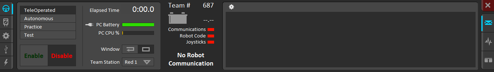
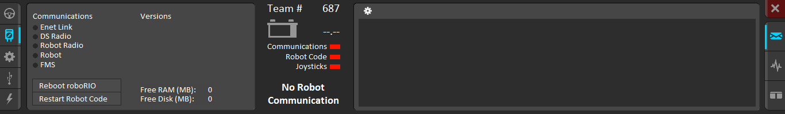
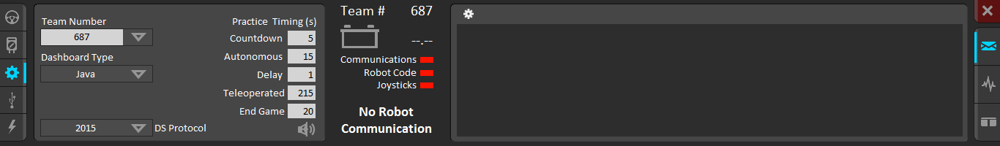
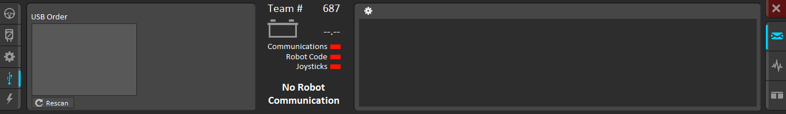

# Introduction to Robot Programming

### What is Robot Programming?
Robot programming is an interface for the drivers to control the robot. Although invisible and intangible, software is one of the most important parts of the robot. As I like to say, "Good software can make a bad robot win but bad software will make a good robot loose".

### Game Structure
Most FRC games are structured into two different periods: a 15 second autonomous period and a 2 minute and 15 second teleoperated period. During the autonomous period, robots act on their own as the drivers must stay clear of the driver station. During the teleoperated period, the drivers step forward and take the controls to direct their robots to victory.

### Code Structure
When it comes to programming robots, Team 687 extends the Java IterativeRobot class. This allows us to use seven built-in functions that initialize and loop through the periods of the game.

Each period of the game, autonomous, teleop, and test (we'll get into this later), has two functions associated with it: `init` and `periodic`. The `init` function is called once as soon as the mode starts. This is where all objects should be constructed and subsystems initialized. The `periodic` function gets called regularly at approximately 40 hertz while the robot is enabled. In addition to these, there is one last function, `robotInit()`. This function gets called as soon as the robot turns on and is first enabled.

### WPILIB
Worchester Polytechnic Institute (WPI) is one of the main sponsors of FRC, and is the college where Dean Kamen, the founder of FIRST, attended before dropping out, inventing the segway, making billions of dollars (go Dean!). WPI has also created WPILIB, a library meant to help control the robot.

WPILIB can be broken down into the following categories:
- Motors
  - Victor
  - Talon
  - CANTalon
- Pneumatics
  - Compressor
  - Solenoid
  - DoubleSolenoid
- Sensors
  - Encoder
  - Gyro
  - Ultrasonic
  - PowerDistributionPanel
- IO
  - DigitalInput
  - DigitalOutput
  - AnalogInput
  - AnalogOutput
  - I2C
  - SPI
- Interface
  - Joystick
  - SmartDashboard

  > Note: There are many more classes to WPILIB, these are just a few commonly used ones.

  Each of these classes has javadoc documentation that can be found [here](http://first.wpi.edu/FRC/roborio/release/docs/java/)

### Driver Station
In order to drive the robot, FRC uses a program called `FRC Driver Station`. It is automatically installed along with the FRC Update Suite. There are five main panels to the driver station:
- Operation
- Diagnostics
- Setup
- USB Devices
- Power & CAN

###### Operation

The first thing you should notice is the big Enable/Disable switch. Switching this on to Enable will start the robot code and allow the robot to move and react to joystick input. Hitting the Enter key will disable the robot and hitting the Space Bar will put the robot into Emergency Stop. Directly above this is the mode selector. While running the robot off field, you must select which mode is being run, whether it is teleop, autonomous, or test. Practice mode cycles through autonomous then test, as if it is an actual match. To the right of this is some useful information, including computer specs. To the right of that is the status pane. These will tell you whether or not your computer and robot are properly set up to start running. Lastly the rightmost panel is the notification area, where the various errors and warnings will show.

###### Diagnostics

The diagnostics panel includes more status indicators which will help debug where communication error happen. In addition, it shows the version numbers (not shown in the screenshot) that are necessary to passing inspection. Lastly, most importantly, it has two buttons which restart the RoboRIO and Robot Code which can be incredibly useful, as restarting the whole robot can take too much time.

###### Setup

The setup panel contains all settings vital to the driver station functioning properly. Make sure the Team number is set to `687` (unless you are on another team) and the DS Protocol is set to 2015. For connecting to older robots that still use the previous control system, set the DS Protocol to `2014`.

###### USB Devices

The USB Devices panel is where all joysticks and computer connected peripherals are configured to be mapped to certain ports. To change the ports, each device can be dragged up and down to a different spot, and the devices can be locked in by double clicking them.

###### Power

### Automation
> incomplete
