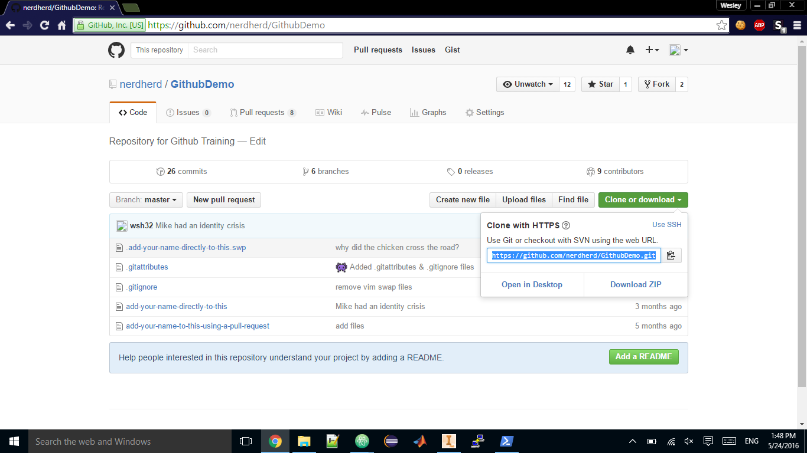

# eGit

### What is eGit?
eGit is a plugin that integrates Github directly into the Eclipse IDE. 

### Installation
eGit is located in an online repository. This can be installed by going in Eclipse's `Help > Install New Software`. From here, copy paste the following link: `http://download.eclipse.org/egit/updates` then clicking `Select All`, followed by Next. This will lead you through the installation wizard. 

### Usage
###### Clone
Cloning can be done in Eclipse's `File > Import > Git > Projects from Git > Clone URI`. The URI can be found on the repository site, as follows:

After inputting the URI, the rest of the spaces should fill automatically (except for username and password, unless you have those stored). It will then have you select which branch(es) to clone. Usually, the main code to use is in the `master` branch and the test codes are located in the other branches. Then, it will ask you to verify the local location and where the projects are located, just use the default values provided. 

> Try this! Clone the [GithubTraining](https://github.com/nerdherd/GithubTraining) repository located in the Nerd Herd organization!

###### Changing code
Once the clone is successful, you will see the new project appear in your workspace. You can now freely edit the code just as you would change a regular github project. 

> Try this! Edit the code (the file called `Training.java`) so that it will print "Hello, (insert name here)"

###### Commit and Push
Once you finish your edits, you need to commit your changes and push the code. To do so, right click on the project in the workspace manager, and go to `Team > Commit` (or press `Ctrl+SHIFT+3`)

This will create a pop up menu. The first thing to do is drag all the files from the "Unstaged Changes" area to the "Staged Changes" area. Once you do this, you must now create a commit message. Usually commit messages are clear and concise summaries of the changes.

Once this is done, click `Commit and Push` to create your commit and push it upstream to the server.

> Try this! Commit your edits and push them to the Github Server!