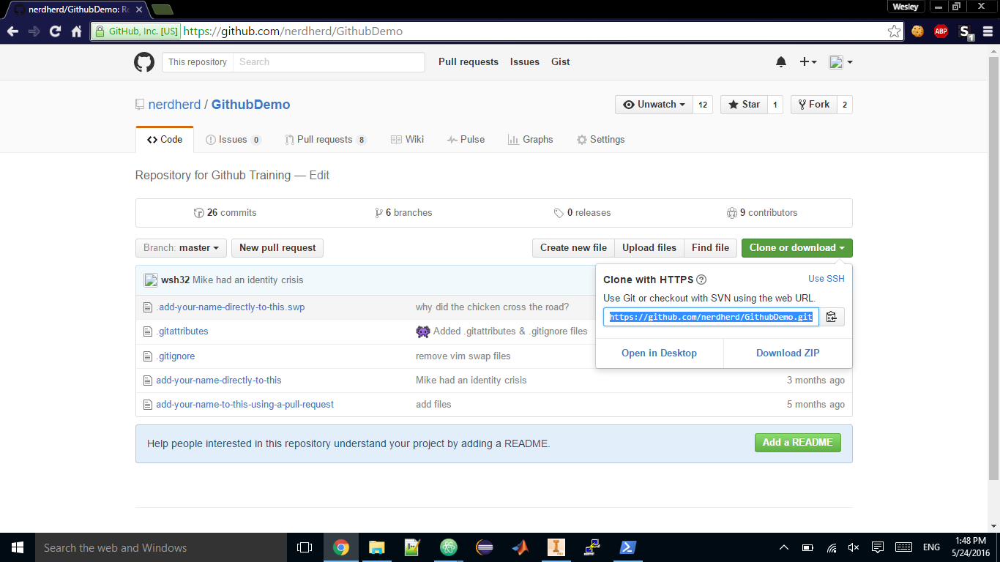

# Intro To Github

### What is Github?
Github is a collaborative version control system. What does this mean? Github allows you to store your code and keeps track of all revisions you make and share it with your team.

### Github 101
The basic theory of Github is for the user to commit each change made to the code. That means that every change made is stored logically along with a commit message, a description of the change made. These commits are stored in a *local repository*, a copy of the repository located on your computer. After committing to your local repository, you need to *push*, or sync, to the *remote repository*, the copy stored on Github.

### Installing Github
Please refer to [this guide](https://help.github.com/desktop/guides/getting-started/installing-github-desktop/).

### Using Github Desktop
> Incomplete

### Using Git Shell
We will be using the [GithubDemo](https://github.com/nerdherd/GithubDemo) repository located in the Nerd Herd organization.

1. Move into the parent directory
 * The Parent Directory is the directory above the target. For example, if you wanted to clone the repository into ```C:\Users\Wesley\Desktop\frc\GithubDemo```, you would navigate to ```C:\Users\Wesley\Desktop\frc```
 * The basic command for navigating in the shell is ```cd```. So if you wanted to navigate into ```C:\Users\Wesley\Desktop\frc```, you would enter ```cd C:\Users\Wesley\Desktop\frc```.
 > Note: In Windows, the directories are NOT case sensitive. However, they are in OSX and Linux.

2. Clone the repository.
  * Use the command ```git clone (Clone URL)```
  * So if you wanted to clone GithubDemo, first find the Clone URL. This can be found in the upper right corner.

  

  * Now run the command!
  * ```git clone https://github.com/nerdherd/GithubDemo.git```
  * You will notice a new directory has been created, an exact copy of what is shown on Github.

3. Make your changes.
  * Upgrade your code!

4. Synthesize your commit!
  * The first step of committing is to add all the changed files to the repository. Go to the project head (in my case, ```C:\Users\Wesley\Desktop\frc\GithubDemo```) and run: ```git add .```. This registers all changes to the git repository.
  * Next, commit the changes with ```git commit -m 'insert clever commit message here'```.

5. Push your changes!
  * Lastly, execute ```git push``` to push the commits upstream.

### Further Reading
* [Github Documentation](https://help.github.com/)
